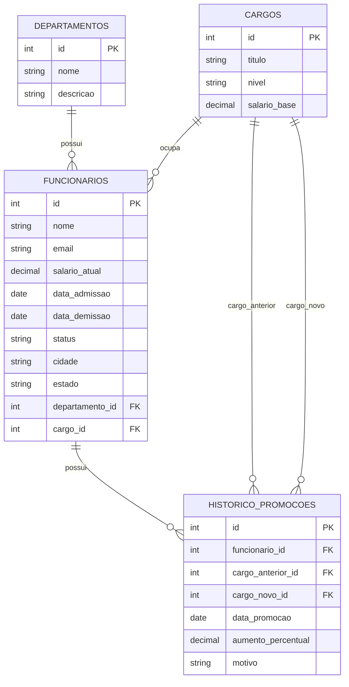

# Projeto RH - SQL Server


## Sobre o projeto

Este projeto foi desenvolvido para praticar conceitos de Banco de Dados utilizando **SQL Server** e **T-SQL**.

O banco simula um ambiente de Recursos Humanos, contendo informações sobre funcionários, departamentos, cargos e histórico de promoções.

## Objetivo

Criar um banco de dados relacional para análises de RH, praticando desde consultas básicas até recursos mais avançados de SQL.

## Tecnologias utilizadas

- SQL Server 2022
- SQL Server Management Studio - SSMS
- T-SQL
- GitHub
- Mermaid para documentação do ERD

## Estrutura do banco de dados

O projeto possui as seguintes tabelas:

- `departamentos`
- `cargos`
- `funcionarios`
- `historico_promocoes`

## Diagrama do banco de dados - ERD



## Modelo relacional

```text
departamentos
    └── funcionarios

cargos
    └── funcionarios

funcionarios
    └── historico_promocoes

cargos
    ├── historico_promocoes.cargo_anterior_id
    └── historico_promocoes.cargo_novo_id
```

## Conteúdo desenvolvido

### Nível básico

- Criação do banco de dados
- Criação das tabelas
- Inserção de registros
- Total de funcionários por departamento
- Média salarial geral
- Listagem dos 10 maiores salários

### Nível intermediário

- JOINs entre tabelas
- Subconsultas
- Percentual de distribuição de funcionários por departamento
- Comparação salarial entre departamentos
- Identificação dos funcionários com mais tempo de empresa

### Nível avançado

- CTEs
- Window Functions
- LAG()
- LEAD()
- RANK()
- Cálculo de turnover por departamento
- Análise de evolução de promoções
- Criação de views reutilizáveis
- Ranking de performance por múltiplos critérios

## Estrutura sugerida do repositório

```text
ProjetoRH/
│
├── README.md
│
├── scripts/
│   ├── 01-criacao-banco.sql
│   ├── 02-criacao-tabelas.sql
│   ├── 03-inserts.sql
│   ├── 04-consultas-basicas.sql
│   ├── 05-consultas-intermediarias.sql
│   ├── 06-consultas-avancadas.sql
│   ├── 07-views.sql
│   ├── 08-ctes.sql
│   └── 09-window-functions.sql
│
├── docs/
│   └── erd.md
│
└── imagens/
    └── ssms.png
```

## Consultas implementadas

### Total de funcionários por departamento

```sql
SELECT
    d.nome AS departamento,
    COUNT(f.id) AS total_funcionarios
FROM dbo.departamentos d
INNER JOIN dbo.funcionarios f
    ON f.departamento_id = d.id
GROUP BY d.nome
ORDER BY total_funcionarios DESC;
```

### Média salarial geral

```sql
SELECT
    AVG(salario_atual) AS media_salarial_geral
FROM dbo.funcionarios;
```

### Top 10 maiores salários

```sql
SELECT TOP 10
    f.nome AS funcionario,
    d.nome AS departamento,
    c.titulo AS cargo,
    f.salario_atual
FROM dbo.funcionarios f
INNER JOIN dbo.departamentos d
    ON d.id = f.departamento_id
INNER JOIN dbo.cargos c
    ON c.id = f.cargo_id
ORDER BY f.salario_atual DESC;
```

## Views criadas

### View de funcionários completa

```sql
CREATE VIEW dbo.vw_funcionarios_completa AS
SELECT
    f.id AS funcionario_id,
    f.nome AS funcionario,
    f.email,
    d.nome AS departamento,
    c.titulo AS cargo,
    c.nivel,
    c.salario_base,
    f.salario_atual,
    f.data_admissao,
    f.data_demissao,
    f.status,
    f.cidade,
    f.estado
FROM dbo.funcionarios f
INNER JOIN dbo.departamentos d
    ON d.id = f.departamento_id
INNER JOIN dbo.cargos c
    ON c.id = f.cargo_id;
```

### View de histórico de promoções

```sql
CREATE VIEW dbo.vw_historico_promocoes_completo AS
SELECT
    hp.id AS promocao_id,
    f.nome AS funcionario,
    d.nome AS departamento,
    ca.titulo AS cargo_anterior,
    cn.titulo AS cargo_novo,
    hp.data_promocao,
    hp.aumento_percentual,
    hp.motivo
FROM dbo.historico_promocoes hp
INNER JOIN dbo.funcionarios f
    ON f.id = hp.funcionario_id
INNER JOIN dbo.departamentos d
    ON d.id = f.departamento_id
INNER JOIN dbo.cargos ca
    ON ca.id = hp.cargo_anterior_id
INNER JOIN dbo.cargos cn
    ON cn.id = hp.cargo_novo_id;
```

## Exemplos de análises

- Quantidade de funcionários por departamento
- Média salarial geral
- Média salarial por departamento
- Funcionários acima da média salarial
- Funcionários com maior tempo de empresa
- Distribuição percentual de funcionários
- Turnover por departamento
- Histórico de promoções
- Evolução de cargo por funcionário
- Ranking de performance por departamento

## Aprendizados

Durante o desenvolvimento deste projeto foram praticados conceitos como:

- Modelagem de banco de dados
- Relacionamentos entre tabelas
- Chaves primárias
- Chaves estrangeiras
- JOINs
- Subconsultas
- CTEs
- Views
- Window Functions
- Funções analíticas
- Agregações
- Ranking de dados
- Boas práticas em SQL Server

## Como executar o projeto

1. Abra o SQL Server Management Studio.
2. Crie o banco de dados `ProjetoRH`.
3. Execute os scripts na seguinte ordem:

```text
01-criacao-banco.sql
02-criacao-tabelas.sql
03-inserts.sql
04-consultas-basicas.sql
05-consultas-intermediarias.sql
06-consultas-avancadas.sql
07-views.sql
08-ctes.sql
09-window-functions.sql
```

4. Execute as consultas para validar os resultados.

## Autor

Daniel Augusto Gomes

LinkedIn:  
https://www.linkedin.com/in/danielaugustogomes/

## Status do projeto

Projeto em desenvolvimento para estudos e portfólio.

---
Projeto desenvolvido para praticar SQL Server, T-SQL e modelagem de banco de dados.